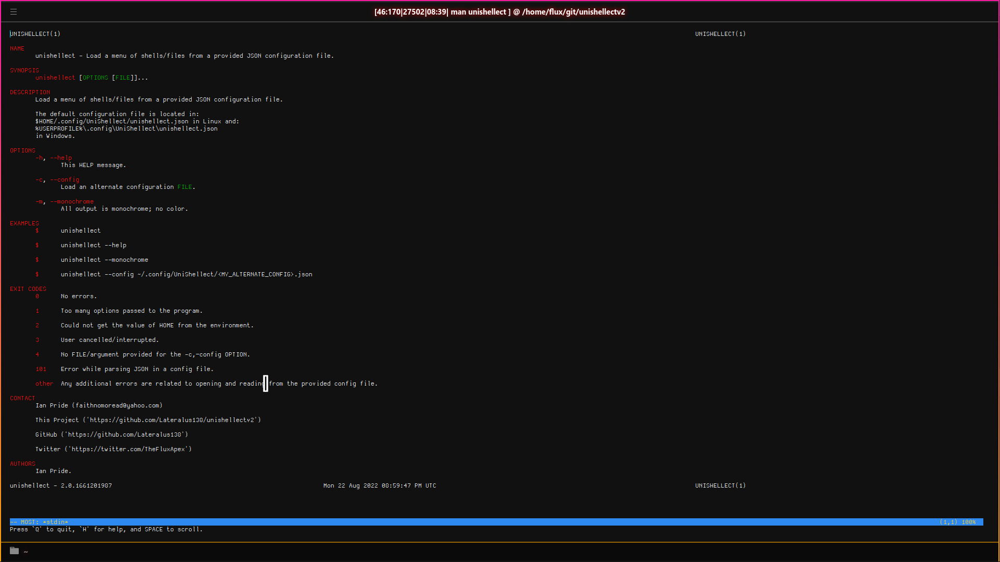

# UniShellect V2 

&#x4C;&#x6F;&#x61;&#x64;&#x20;&#x61;&#x20;&#x6D;&#x65;&#x6E;&#x75;&#x20;&#x6F;&#x66;&#x20;&#x73;&#x68;&#x65;&#x6C;&#x6C;&#x73;&sol;&#x66;&#x69;&#x6C;&#x65;&#x73;&#x20;&#x66;&#x72;&#x6F;&#x6D;&#x20;&#x61;&#x20;&#x70;&#x72;&#x6F;&#x76;&#x69;&#x64;&#x65;&#x64;&#x20;&#x4A;&#x53;&#x4F;&#x4E;&#x20;&#x63;&#x6F;&#x6E;&#x66;&#x69;&#x67;&#x75;&#x72;&#x61;&#x74;&#x69;&#x6F;&#x6E;&#x20;&#x66;&#x69;&#x6C;&#x65;&period;&#x20;&#x56;&#x65;&#x72;&#x73;&#x69;&#x6F;&#x6E;&#x20;&#x32;&#x20;&#x2D;&#x20;&#x43;&plus;&plus;&#x20;&#x72;&#x65;&#x77;&#x72;&#x69;&#x74;&#x65;&period;

---

***COMING SOON***

<sub>&period;&period;&period;&#x62;&#x75;&#x74;&#x20;&#x73;&#x6F;&#x6D;&#x65;&#x20;&#x77;&#x6F;&#x72;&#x6B;&#x69;&#x6E;&#x67;&#x20;&#x70;&#x72;&#x65;&#x2D;&#x72;&#x65;&#x6C;&#x65;&#x61;&#x73;&#x65;&#x64;&#x20;&#x76;&#x65;&#x72;&#x73;&#x69;&#x6F;&#x6E;&#x73;&#x20;&#x6F;&#x66;&#x20;&#x74;&#x68;&#x65;&#x20;&#x70;&#x72;&#x6F;&#x67;&#x72;&#x61;&#x6D;&#x73;&#x20;&#x63;&#x61;&#x6E;&#x20;&#x62;&#x65;&#x20;&#x66;&#x6F;&#x75;&#x6E;&#x64;&#x20;&#x69;&#x6E;&#x20;&#x74;&#x68;&#x65; [`Releases`](https://github.com/Lateralus138/unishellectv2/releases) &#x73;&#x65;&#x63;&#x74;&#x69;&#x6F;&#x6E;&period;</sub>

![Under Construction](https://img.shields.io/static/v1?logo=data:image/png;base64,iVBORw0KGgoAAAANSUhEUgAAAA4AAAAOCAYAAAAfSC3RAAACmElEQVQokUWSa0iTcRTGn//26u4b6ZQ0U8lKMqykwPpgZVBEHyLp8jEoIZJADCQ0iCiStIwuZmHRioIuroQss2VkrkIrdeFckiZqdhctTXPOve8Tr7M6X8/zO+fwPEfIwy7IwQA0GgExGYQwyhCmMLRX1z2hJCJSN+xZgqAZnPgCaAUQ0EHICjSYLlKBCDdNQb7HLmeRoy3zQFnzYk/1WTckGUIXCVD+Kw+BpAxtuBXCpkN7bdXt/JL3W3J3xuHg3iTsL/NkNFWVPoWkQOj/wxooCrRhFgiTjI4n9ZVHHQObjxVEY8UGIi1zEhVFCahwdq5qvn+hHkKC0EcBigxwvAnkW3ge7L6TMi+VztOLOOKOY8ulKL68GM2emnjeLF3AZSlz2FCZ6yaHwLGv6pkv8MyxsUoHLcsLwBuHwE0rtdy2UuLWNTpmpkkszQEfnAPDAd47tbaB7NaJR+eXujfmtGTUXgFWp5uwPd8Oi1GBJEmwWYlP34L4PSFw7chPeD+MYnkWUVmy0CeNfe5N8ANIjNWpNmHzqklYrDIGRwRm2gXsM/xofRMOf1AgcbYOAfgxMvgxCmS9+dbh5A6VarxuIMdBDoJ0g+vSreytNpAEux7qqWrK82I+kC2xYOAzyFbz5QNJPrXhdRo4XK/n3WILkxPsbKqwsr8xBB3PjukhGyJJv+qqB+QvkN0mR2Fim5pU1hobzxTYOPbcyJoTNpoAlu6wdZKvIslR0O9VXe0Clc5p2Ge4WDh36ux3ThM/1RqnNhXvilU32cjvINtAf4cKdkzlSHpBTqgNY11JfLtFA+o14NU8Wx/piggNfg2yGVR8EF9/dP37PyCIoDQLs8z9hmv71nsC4wFz9klX2tD4/AEG+gBoQ7KghD8MZ2xdnt7s7wAAAABJRU5ErkJggg==&label=Under&message=Construction&style=for-the-badge&color=b91d47&labelColor=1d1d1d)

---

1. [About](#about)
   1. [Description](#description)
   2. [Motivation](#motivation)
2. [Usage](#usage)
   1. [Environment](#environment)
   2. [Files](#files)
      1. [Debian Installer](#debian-installer)
         1. [Deb Install](#deb-install)
         2. [Deb Provides](#deb-provides)
            1. [Bash Completion](#bash-completion)
            2. [HiColor Icon Theme](#hicolor-icon-theme)
            3. [Man Page Entry](#man-page-entry)
      2. [Portable](#portable)
         1. [Portable Linux](#portable-linux)
         2. [Portable AppImage](#portable-appimage)
         3. [Portable Android](#portable-android)
         4. [Portable Windows](#portable-windows)
      3. [Bash Completion File](#bash-completion-file)
      4. [Configuration File](#configuration-file)
   3. [Current Builds MD5](#current-builds-md5)
      1. [Current Linux MD5](#current-linux-md5)
      2. [Current Debian MD5](#current-debian-md5)
      3. [Current Android AARCH64 MD5](#current-android-aarch64-md5)
      4. [Current AppImage MD5](#current-appimage-md5)
      5. [Current Windows X86 MD5](#current-windows-x86-md5)
      6. [Current Windows X64 MD5](#current-windows-x64-md5)
3. [Examples](#examples)
   1. [Help Screen](#help-screen)
   2. [Normal Usage](#normal-usage)
   3. [Alternate Configuration File](#alternate-configuration-file)
4. [Media](#media)
   1. [Logo](#logo)
   2. [Help Screen](#help-screen-1)
   3. [Man Page](#man-page)
   4. [Demonstration](#demonstration)
5. [Contribute](#contribute)
   1. [Project](#project)
   2. [Donate](#donate)
6. [LICENSE](#license)

---

## About

&#x56;&#x65;&#x72;&#x73;&#x69;&#x6F;&#x6E;&#x20;&#x32;&#x20;&#x6F;&#x66; [UniShellect](https://github.com/Lateralus138/unishellect).

&#x56;&#x65;&#x72;&#x73;&#x69;&#x6F;&#x6E;&#x20;&#x31;&#x20;&#x77;&#x61;&#x73;&#x20;&#x77;&#x72;&#x69;&#x74;&#x74;&#x65;&#x6E;&#x20;&#x69;&#x6E; *Fortran* &#x61;&#x6E;&#x64;&#x20;&#x68;&#x61;&#x73;&#x20;&#x61;&#x20;&#x73;&#x6C;&#x69;&#x67;&#x68;&#x74;&#x20;&#x62;&#x75;&#x67;&#x20;&#x69;&#x6E;&#x20;&#x74;&#x68;&#x65;&#x20;&#x4A;&#x53;&#x4F;&#x4E;&#x20;&#x70;&#x61;&#x72;&#x73;&#x69;&#x6E;&#x67;&#x20;&#x74;&#x68;&#x61;&#x74;&#x20;&#x49;&apos;&#x64;&#x20;&#x70;&#x72;&#x65;&#x66;&#x65;&#x72;&#x20;&#x6E;&#x6F;&#x74;&#x20;&#x74;&#x6F;&#x20;&#x66;&#x69;&#x78;&#x20;&#x61;&#x73;&#x20;&#x49;&#x20;&#x77;&#x61;&#x6E;&#x74;&#x65;&#x64;&#x20;&#x74;&#x6F;&#x20;&#x77;&#x72;&#x69;&#x74;&#x65;&#x20;&#x74;&#x68;&#x69;&#x73;&#x20;&#x6E;&#x65;&#x77;&#x20;&#x76;&#x65;&#x72;&#x73;&#x69;&#x6F;&#x6E;&#x20;&#x61;&#x6E;&#x79;&#x77;&#x61;&#x79;&period;&#x20;&#x54;&#x68;&#x65;&#x20;&#x62;&#x75;&#x67;&#x20;&#x63;&#x61;&#x75;&#x73;&#x65;&#x73;&#x20;&#x74;&#x68;&#x65;&#x20;&#x70;&#x72;&#x6F;&#x67;&#x72;&#x61;&#x6D;&#x20;&#x74;&#x6F;&#x20;&#x6E;&#x6F;&#x74;&#x20;&#x62;&#x65;&#x20;&#x61;&#x62;&#x6C;&#x65;&#x20;&#x74;&#x6F;&#x20;&#x70;&#x61;&#x72;&#x73;&#x65;&#x20;&#x6D;&#x6F;&#x72;&#x65;&#x20;&#x74;&#x68;&#x61;&#x6E;&#x20;&#x39;&#x20;&#x65;&#x6E;&#x74;&#x72;&#x69;&#x65;&#x73;&period;&#x20;&#x56;&#x65;&#x72;&#x73;&#x69;&#x6F;&#x6E;&#x20;&#x32;&#x20;&#x69;&#x73;&#x20;&#x77;&#x72;&#x69;&#x74;&#x74;&#x65;&#x6E;&#x20;&#x69;&#x6E; *&#x43;&plus;&plus;* &#x61;&#x6E;&#x64;&#x20;&#x6E;&#x65;&#x67;&#x61;&#x74;&#x65;&#x73;&#x20;&#x74;&#x68;&#x69;&#x73;&#x20;&#x69;&#x73;&#x73;&#x75;&#x65;&period;

### Description

&#x54;&#x68;&#x69;&#x73;&#x20;&#x74;&#x6F;&#x6F;&#x6C;&#x20;&#x70;&#x61;&#x72;&#x73;&#x65;&#x73;&#x20;&#x61;&#x20;&#x4A;&#x53;&#x4F;&#x4E;&#x20;&#x63;&#x6F;&#x6E;&#x66;&#x69;&#x67;&#x75;&#x72;&#x61;&#x74;&#x69;&#x6F;&#x6E;&#x20;&#x66;&#x69;&#x6C;&#x65;&#x20;&#x61;&#x6E;&#x64;&#x20;&#x6C;&#x6F;&#x61;&#x64;&#x73;&#x20;&#x61;&#x20;&#x68;&#x69;&#x67;&#x68;&#x6C;&#x79;&#x20;&#x63;&#x75;&#x73;&#x74;&#x6F;&#x6D;&#x69;&#x7A;&#x61;&#x62;&#x6C;&#x65;&#x20;&#x6D;&#x65;&#x6E;&#x75;&#x20;&#x6F;&#x66;&#x20;&#x73;&#x68;&#x65;&#x6C;&#x6C;&#x73;&comma;&#x20;&#x69;&#x6E;&#x74;&#x65;&#x72;&#x70;&#x72;&#x65;&#x74;&#x65;&#x72;&#x73;&comma;&#x20;&#x66;&#x69;&#x6C;&#x65;&#x73;&comma;&#x20;&#x63;&#x6F;&#x6D;&#x6D;&#x61;&#x6E;&#x64;&#x73;&#x20;&#x61;&#x6E;&#x64;&#x20;&#x70;&#x6F;&#x73;&#x73;&#x69;&#x62;&#x6C;&#x65;&#x20;&#x61;&#x72;&#x67;&#x75;&#x6D;&#x65;&#x6E;&#x74;&#x73;&#x20;&#x69;&#x6E;&#x74;&#x6F;&#x20;&#x61;&#x6E;&#x79;&#x20;&#x63;&#x6F;&#x6D;&#x6D;&#x61;&#x6E;&#x64;&#x20;&#x6C;&#x69;&#x6E;&#x65;&#x20;&#x69;&#x6E;&#x74;&#x65;&#x72;&#x66;&#x61;&#x63;&#x65;&period;&NewLine;&NewLine;&#x56;&#x61;&#x72;&#x69;&#x6F;&#x75;&#x73;&#x20;&#x63;&#x6F;&#x6E;&#x66;&#x69;&#x67;&#x75;&#x72;&#x61;&#x74;&#x69;&#x6F;&#x6E;&#x20;&#x66;&#x69;&#x6C;&#x65;&#x73;&#x20;&#x63;&#x61;&#x6E;&#x20;&#x62;&#x65;&#x20;&#x6C;&#x6F;&#x61;&#x64;&#x65;&#x64;&#x20;&#x61;&#x6E;&#x64;&#x20;&#x74;&#x68;&#x69;&#x73;&#x20;&#x63;&#x61;&#x6E;&#x20;&#x62;&#x65;&#x20;&#x67;&#x72;&#x65;&#x61;&#x74;&#x20;&#x66;&#x6F;&#x72;&#x20;&#x6C;&#x6F;&#x61;&#x64;&#x69;&#x6E;&#x67;&#x20;&#x76;&#x61;&#x72;&#x69;&#x6F;&#x75;&#x73;&#x20;&#x6D;&#x65;&#x6E;&#x75;&#x73;&#x20;&#x62;&#x61;&#x73;&#x65;&#x64;&#x20;&#x6F;&#x6E;&#x20;&#x76;&#x61;&#x72;&#x69;&#x6F;&#x75;&#x73;&#x20;&#x63;&#x72;&#x69;&#x74;&#x65;&#x72;&#x69;&#x61;&colon;&NewLine;&#x45;&period;&#x67;&period;&#x20;&#x70;&#x72;&#x6F;&#x6A;&#x65;&#x63;&#x74;&#x20;&#x6D;&#x65;&#x6E;&#x75;&#x73;&comma;&#x20;&#x77;&#x6F;&#x72;&#x6B;&#x20;&#x6D;&#x65;&#x6E;&#x75;&#x73;&comma;&#x20;&#x67;&#x61;&#x6D;&#x65;&#x20;&#x6D;&#x65;&#x6E;&#x75;&#x73;&comma;&#x20;&#x65;&#x74;&#x63;&#x65;&#x74;&#x65;&#x72;&#x61;&period;

&#x59;&#x6F;&#x75;&#x20;&#x63;&#x61;&#x6E;&#x20;&#x61;&#x6C;&#x73;&#x6F;&#x20;&#x73;&#x65;&#x74;&#x20;&#x73;&#x75;&#x62;&#x2D;&#x6D;&#x65;&#x6E;&#x75;&#x73;&#x20;&#x62;&#x79;&#x20;&#x75;&#x73;&#x69;&#x6E;&#x67; **&#x75;&#x6E;&#x69;&#x73;&#x68;&#x65;&#x6C;&#x6C;&#x65;&#x63;&#x74;** &#x69;&#x74;&#x73;&#x65;&#x6C;&#x66;&#x20;&#x61;&#x73;&#x20;&#x74;&#x68;&#x65; *&#x50;&#x61;&#x74;&#x68;* &#x61;&#x6E;&#x64;&#x20;&#x70;&#x61;&#x73;&#x73;&#x20;&#x74;&#x68;&#x65;&#x20;&#x73;&#x75;&#x62;&#x20;&#x6D;&#x65;&#x6E;&#x75;&#x20;&#x66;&#x69;&#x6C;&#x65;&#x20;&#x61;&#x73;&#x20;&#x74;&#x68;&#x65; *&#x41;&#x72;&#x67;&#x73;*&period;

&#x54;&#x68;&#x69;&#x73;&#x20;&#x69;&#x73;&#x20;&#x61; *cross-platform* [***FOSS***](https://duckduckgo.com/?q=FOSS&ia=web) &#x70;&#x72;&#x6F;&#x6A;&#x65;&#x63;&#x74;&period;

### Motivation

&#x54;&#x68;&#x69;&#x73;&#x20;&#x69;&#x73;&#x20;&#x69;&#x6E;&#x73;&#x70;&#x69;&#x72;&#x65;&#x64;&#x20;&#x62;&#x79;&#x20;&#x74;&#x68;&#x65; ***&#x68;&#x79;&#x70;&#x65;&#x72;&#x2D;&#x73;&#x68;&#x65;&#x6C;&#x6C;&#x65;&#x63;&#x74;*** &#x70;&#x6C;&#x75;&#x67;&#x2D;&#x69;&#x6E;&#x20;&#x66;&#x6F;&#x72;&#x20;&#x74;&#x68;&#x65; ***&#x48;&#x79;&#x70;&#x65;&#x72;*** &#x74;&#x65;&#x72;&#x6D;&#x69;&#x6E;&#x61;&#x6C;&#x20;&#x77;&#x68;&#x69;&#x63;&#x68;&#x20;&#x69;&#x73;&#x20;&#x64;&#x65;&#x70;&#x65;&#x6E;&#x64;&#x65;&#x6E;&#x74;&#x20;&#x6F;&#x6E; ***&#x6E;&#x6F;&#x64;&#x65;&period;&#x6A;&#x73;***.

&#x54;&#x68;&#x69;&#x73;&#x20;&#x70;&#x61;&#x72;&#x74;&#x69;&#x63;&#x75;&#x6C;&#x61;&#x72;&#x20;&#x76;&#x65;&#x72;&#x73;&#x69;&#x6F;&#x6E;&#x20;&#x77;&#x61;&#x73;&#x20;&#x69;&#x6E;&#x73;&#x70;&#x69;&#x72;&#x65;&#x64;&#x20;&#x66;&#x72;&#x6F;&#x6D;&#x20;&#x74;&#x68;&#x65;&#x20;&#x6E;&#x65;&#x65;&#x64;&#x20;&#x66;&#x6F;&#x72;&#x20;&#x61;&#x20;&#x72;&#x65;&#x77;&#x72;&#x69;&#x74;&#x65;&#x20;&#x6F;&#x66;&#x20;&#x6F;&#x72;&#x69;&#x67;&#x69;&#x6E;&#x61;&#x6C;&period;

&#x49;&#x20;&#x77;&#x6F;&#x72;&#x6B;&#x20;&#x61;&#x6E;&#x64;&#x20;&#x70;&#x6C;&#x61;&#x79;&#x20;&#x69;&#x6E;&#x20;&#x61;&#x6C;&#x6C;&#x20;&#x73;&#x6F;&#x72;&#x74;&#x73;&#x20;&#x6F;&#x66;&#x20;&#x63;&#x6F;&#x6D;&#x6D;&#x61;&#x6E;&#x64;&#x20;&#x6C;&#x69;&#x6E;&#x65;&#x20;&#x65;&#x6E;&#x76;&#x69;&#x72;&#x6F;&#x6E;&#x6D;&#x65;&#x6E;&#x74;&#x73;&#x20;&#x69;&#x6E;&#x20;&#x62;&#x6F;&#x74;&#x68; *&#x57;&#x69;&#x6E;&#x64;&#x6F;&#x77;&#x73;* and *&#x4C;&#x69;&#x6E;&#x75;&#x78;* &#x61;&#x6E;&#x64;&#x20;&#x74;&#x68;&#x69;&#x73;&#x20;&#x68;&#x65;&#x6C;&#x70;&#x73;&#x20;&#x6D;&#x65;&#x20;&#x6F;&#x72;&#x67;&#x61;&#x6E;&#x69;&#x7A;&#x65;&#x20;&#x61;&#x6E;&#x64;&#x20;&#x6E;&#x61;&#x76;&#x69;&#x67;&#x61;&#x74;&#x65;&#x20;&#x74;&#x68;&#x61;&#x74;&#x20;&#x77;&#x6F;&#x72;&#x6C;&#x64;&#x20;&#x6D;&#x6F;&#x72;&#x65;&#x20;&#x65;&#x66;&#x66;&#x69;&#x63;&#x69;&#x65;&#x6E;&#x74;&#x6C;&#x79;&#x20;&#x61;&#x6E;&#x64;&#x20;&#x73;&#x6D;&#x6F;&#x6F;&#x74;&#x68;&#x6C;&#x79;&period;

---

## Usage

&#x57;&#x68;&#x65;&#x6E;&comma;&#x20;&#x77;&#x68;&#x65;&#x72;&#x65;&comma;&#x20;&#x61;&#x6E;&#x64;&#x20;&#x68;&#x6F;&#x77;&#x20;&#x74;&#x6F;&#x20;&#x75;&#x73;&#x65;&#x20;&#x74;&#x68;&#x69;&#x73;&#x20;&#x70;&#x72;&#x6F;&#x67;&#x72;&#x61;&#x6D;&period;

### Environment

&#x54;&#x68;&#x69;&#x73;&#x20;&#x69;&#x73;&#x20;&#x61;&#x6E;&#x20;&#x6F;&#x70;&#x65;&#x6E;&#x2D;&#x73;&#x6F;&#x75;&#x72;&#x63;&#x65;&#x20;&lpar;[FOSS](https://duckduckgo.com/?q=foss&ia=web)&rpar;&#x20;&#x63;&#x6F;&#x6D;&#x6D;&#x61;&#x6E;&#x64;&#x20;&#x6C;&#x69;&#x6E;&#x65;&#x20;&#x75;&#x74;&#x69;&#x6C;&#x69;&#x74;&#x79;&#x20;&#x66;&#x6F;&#x72;&#x20;&#x75;&#x73;&#x65;&#x20;&#x69;&#x6E;&#x20;&#x4C;&#x69;&#x6E;&#x75;&#x78;&comma;&#x20;&#x57;&#x69;&#x6E;&#x64;&#x6F;&#x77;&#x73;&comma;&#x20;&#x61;&#x6E;&#x64;&#x20;&#x41;&#x6E;&#x64;&#x72;&#x6F;&#x69;&#x64;&#x20;&#x73;&#x68;&#x65;&#x6C;&#x6C;&#x73;&#x20;&lpar;&#x74;&#x65;&#x72;&#x6D;&#x69;&#x6E;&#x61;&#x6C;&#x73;&sol;&#x74;&#x74;&#x79;&#x73;&sol;&#x54;&#x65;&#x72;&#x6D;&#x75;&#x78;&sol;&#x65;&#x74;&#x63;&period;&rpar;&period;&#x20;&#x54;&#x68;&#x69;&#x73;&#x20;&#x63;&#x61;&#x6E;&#x20;&#x62;&#x65;&#x20;&#x62;&#x75;&#x69;&#x6C;&#x74;&#x20;&#x66;&#x72;&#x6F;&#x6D;&#x20;&#x73;&#x6F;&#x75;&#x72;&#x63;&#x65;&#x20;&lpar;&#x61;&#x73;&#x20;&#x70;&#x65;&#x72;&#x20;&#x74;&#x68;&#x65;&#x20;&#x4C;&#x49;&#x43;&#x45;&#x4E;&#x53;&#x45;&#x20;&#x66;&#x69;&#x6C;&#x65;&#x20;&#x70;&#x72;&#x6F;&#x76;&#x69;&#x64;&#x65;&#x64;&rpar;&comma;&#x20;&#x75;&#x73;&#x65;&#x64;&#x20;&#x70;&#x6F;&#x72;&#x74;&#x61;&#x62;&#x6C;&#x79;&#x20;&lpar;&#x73;&#x69;&#x6E;&#x67;&#x6C;&#x65;&#x20;&#x65;&#x78;&#x65;&#x63;&#x75;&#x74;&#x61;&#x62;&#x6C;&#x65;&#x20;&#x70;&#x75;&#x74;&#x20;&#x77;&#x68;&#x65;&#x72;&#x65;&#x76;&#x65;&#x72;&#x20;&#x79;&#x6F;&#x75;&#x20;&#x6C;&#x69;&#x6B;&#x65;&rpar;&comma;&#x20;&#x6F;&#x72;&#x20;&#x69;&#x6E;&#x73;&#x74;&#x61;&#x6C;&#x6C;&#x65;&#x64;&#x20;&#x76;&#x69;&#x61;&#x20;&#x74;&#x68;&#x65;&#x20;&#x70;&#x72;&#x6F;&#x76;&#x69;&#x64;&#x65;&#x64;&#x20;&#x44;&#x65;&#x62;&#x69;&#x61;&#x6E;&#x20;&lpar;&period;&#x64;&#x65;&#x62;&rpar;&#x20;&#x70;&#x61;&#x63;&#x6B;&#x61;&#x67;&#x65;&period;&#x20;&#x41;&#x6E;&#x20;*&#x41;&#x70;&#x70;&#x49;&#x6D;&#x61;&#x67;&#x65;*&#x20;&#x66;&#x6F;&#x72;&#x20;&#x74;&#x68;&#x65;&#x20;&#x4C;&#x69;&#x6E;&#x75;&#x78;&#x20;&#x76;&#x65;&#x72;&#x73;&#x69;&#x6F;&#x6E;&#x20;&#x69;&#x73;&#x20;&#x70;&#x72;&#x6F;&#x76;&#x69;&#x64;&#x65;&#x64;&#x20;&#x61;&#x73;&#x20;&#x77;&#x65;&#x6C;&#x6C;&period;

&#x54;&#x68;&#x65;&#x20;&#x72;&#x65;&#x63;&#x6F;&#x6D;&#x6D;&#x65;&#x6E;&#x64;&#x65;&#x64;&#x20;&#x6D;&#x65;&#x74;&#x68;&#x6F;&#x64;&#x20;&#x6F;&#x66;&#x20;&#x75;&#x73;&#x65;&#x20;&#x69;&#x73;&#x20;&#x76;&#x69;&#x61;&#x20;&#x74;&#x68;&#x65;&#x20;&#x44;&#x65;&#x62;&#x69;&#x61;&#x6E;&#x20;&#x70;&#x61;&#x63;&#x6B;&#x61;&#x67;&#x65;&#x20;&#x69;&#x6E;&#x73;&#x74;&#x61;&#x6C;&#x6C;&#x61;&#x74;&#x69;&#x6F;&#x6E;&#x20;&#x66;&#x6F;&#x72;&#x20;&#x74;&#x68;&#x65;&#x20;&#x44;&#x65;&#x62;&#x69;&#x61;&#x6E;&#x20;&lpar;&#x61;&#x70;&#x74;&comma;&#x20;&#x64;&#x65;&#x62;&rpar;&#x20;&#x70;&#x61;&#x63;&#x6B;&#x61;&#x67;&#x65;&#x72;&#x20;&#x6D;&#x61;&#x6E;&#x61;&#x67;&#x65;&#x72;&comma;&#x20;&#x62;&#x75;&#x74;&#x20;&#x74;&#x68;&#x65;&#x72;&#x65;&#x20;&#x61;&#x72;&#x65;&#x20;&#x6F;&#x74;&#x68;&#x65;&#x72;&#x20;&#x6D;&#x65;&#x74;&#x68;&#x6F;&#x64;&#x73;&#x20;&#x70;&#x72;&#x6F;&#x76;&#x69;&#x64;&#x65;&#x64;&#x20;&#x68;&#x65;&#x72;&#x65;&#x20;&#x6F;&#x72;&#x20;&#x69;&#x66;&#x20;&#x79;&#x6F;&#x75;&#x20;&#x77;&#x6F;&#x75;&#x6C;&#x64;&#x20;&#x63;&#x61;&#x72;&#x65;&#x20;&#x74;&#x6F;&#x20;&#x70;&#x72;&#x6F;&#x76;&#x69;&#x64;&#x65;&#x20;&#x61;&#x6E;&#x20;&#x69;&#x6E;&#x73;&#x74;&#x61;&#x6C;&#x6C;&#x65;&#x72;&#x20;&#x66;&#x6F;&#x72;&#x20;&#x61;&#x20;&#x64;&#x69;&#x66;&#x66;&#x65;&#x72;&#x65;&#x6E;&#x74;&#x20;&#x70;&#x61;&#x63;&#x6B;&#x61;&#x67;&#x65;&#x20;&#x6D;&#x61;&#x6E;&#x61;&#x67;&#x65;&#x72;&#x20;&#x74;&#x68;&#x65;&#x6E;&#x20;&#x70;&#x6C;&#x65;&#x61;&#x73;&#x65;&#x20;&#x66;&#x6F;&#x72;&#x6B;&#x20;&#x74;&#x68;&#x69;&#x73;&#x20;&#x70;&#x72;&#x6F;&#x6A;&#x65;&#x63;&#x74;&comma;&#x20;&#x62;&#x75;&#x69;&#x6C;&#x64;&#x20;&#x74;&#x68;&#x65;&#x20;&#x61;&#x70;&#x70;&#x72;&#x6F;&#x70;&#x72;&#x69;&#x61;&#x74;&#x65;&#x20;&#x77;&#x6F;&#x72;&#x6B;&#x66;&#x6C;&#x6F;&#x77;&#x20;&#x61;&#x6E;&#x64;&#x20;&#x73;&#x6F;&#x75;&#x72;&#x63;&#x65;&#x20;&#x66;&#x69;&#x6C;&#x65;&#x73;&comma;&#x20;&#x61;&#x6E;&#x64;&#x20;&#x6D;&#x61;&#x6B;&#x65;&#x20;&#x61;&#x20;&#x70;&#x75;&#x6C;&#x6C;&#x2D;&#x72;&#x65;&#x71;&#x75;&#x65;&#x73;&#x74;&period;&#x20;&#x4D;&#x6F;&#x72;&#x65;&#x20;&#x69;&#x6E;&#x66;&#x6F;&#x72;&#x6D;&#x61;&#x74;&#x69;&#x6F;&#x6E;&#x20;&#x61;&#x62;&#x6F;&#x75;&#x74;&#x20;&#x63;&#x6F;&#x6E;&#x74;&#x72;&#x69;&#x62;&#x75;&#x74;&#x69;&#x6E;&#x67;&#x20;[here](#contribute)&period;

### Files

&#x41;&#x6C;&#x6C;&#x20;&#x63;&#x75;&#x72;&#x72;&#x65;&#x6E;&#x74;&#x6C;&#x79;&#x20;&#x62;&#x75;&#x69;&#x6C;&#x74;&#x20;&#x61;&#x6E;&#x64;&#x20;&#x72;&#x65;&#x6C;&#x65;&#x61;&#x73;&#x65;&#x64;&#x20;&#x66;&#x69;&#x6C;&#x65;&#x73;&#x20;&#x63;&#x61;&#x6E;&#x20;&#x62;&#x65;&#x20;&#x66;&#x6F;&#x75;&#x6E;&#x64;&#x20;&#x61;&#x74;&#x20;&#x74;&#x68;&#x65;&#x20;&#x72;&#x65;&#x6C;&#x65;&#x61;&#x73;&#x65;&#x73;&#x20;&#x70;&#x61;&#x67;&#x65;&colon;

[Releases](https://github.com/Lateralus138/unishellectv2/releases)

#### Debian Installer

&#x49;&#x20;&#x70;&#x65;&#x72;&#x73;&#x6F;&#x6E;&#x61;&#x6C;&#x6C;&#x79;&#x20;&#x72;&#x65;&#x63;&#x6F;&#x6D;&#x6D;&#x65;&#x6E;&#x64;&#x20;&#x74;&#x68;&#x69;&#x73;&#x20;&#x6D;&#x65;&#x74;&#x68;&#x6F;&#x64;&#x20;&#x61;&#x73;&#x20;&#x69;&#x74;&#x20;&#x61;&#x75;&#x74;&#x6F;&#x6D;&#x61;&#x74;&#x69;&#x63;&#x61;&#x6C;&#x6C;&#x79;&#x20;&#x69;&#x6E;&#x73;&#x74;&#x61;&#x6C;&#x6C;&#x73;&#x20;&#x61;&#x20;&#x62;&#x61;&#x73;&#x69;&#x63;&#x20;&#x42;&#x61;&#x73;&#x68;&#x20;&#x43;&#x6F;&#x6D;&#x70;&#x6C;&#x65;&#x74;&#x69;&#x6F;&#x6E;&#x20;&#x66;&#x69;&#x6C;&#x65;&comma;&#x20;&#x61;&#x20;&#x68;&#x69;&#x63;&#x6F;&#x6C;&#x6F;&#x72;&#x20;&#x69;&#x63;&#x6F;&#x6E;&#x20;&#x74;&#x68;&#x65;&#x6D;&#x65;&comma;&#x20;&#x61;&#x6E;&#x64;&#x20;&#x61;&#x20;&#x6D;&#x61;&#x6E;&#x20;&#x70;&#x61;&#x67;&#x65;&#x20;&#x65;&#x6E;&#x74;&#x72;&#x79;&period;

##### Deb Install

1. &#x44;&#x6F;&#x77;&#x6E;&#x6C;&#x6F;&#x61;&#x64;&#x20;&#x61;&#x6E;&#x64;&#x20;&#x69;&#x6E;&#x73;&#x74;&#x61;&#x6C;&#x6C;&#x20;&#x74;&#x68;&#x65;&#x20;&#x63;&#x75;&#x72;&#x72;&#x65;&#x6E;&#x74;&#x20;&period;&#x64;&#x65;&#x62;&#x20;&#x69;&#x6E;&#x73;&#x74;&#x61;&#x6C;&#x6C;&#x65;&#x72;&#x20;&#x66;&#x69;&#x6C;&#x65;&#x20;&#x61;&#x74;&#x20;&#x74;&#x68;&#x65;&#x20;[releases page](https://github.com/Lateralus138/unsihellectv2/releases)&period;
2. &#x55;&#x73;&#x65;&#x20;&#x6F;&#x6E;&#x65;&#x20;&#x6F;&#x66;&#x20;&#x76;&#x61;&#x72;&#x69;&#x6F;&#x75;&#x73;&#x20;&#x63;&#x6F;&#x6D;&#x6D;&#x61;&#x6E;&#x64;&#x20;&#x6C;&#x69;&#x6E;&#x65;&#x20;&#x74;&#x6F;&#x6F;&#x6C;&#x73;&#x20;&#x74;&#x6F;&#x20;&#x69;&#x6E;&#x73;&#x74;&#x61;&#x6C;&#x6C;&#x20;&#x74;&#x68;&#x65;&#x20;&#x70;&#x61;&#x63;&#x6B;&#x61;&#x67;&#x65;&colon;
    1. APT
    ```Bash
    sudo apt install /path/to/unishellect-2.0.1661201987.deb -y
    # -y to skip affirmation, not necessary
    ``` 
    2. DPKG
    ```Bash
    sudo dpkg -i /path/to/unishellect-2.0.1661201987.deb
    ```
    3. GDEBI
    ```Bash
    gdebi-gtk /path/to/unishellect-2.0.1661201987.deb
    # or
    sudo gdebi /path/to/unishellect-2.0.1661201987.deb
    ```

##### Deb Provides

&#x54;&#x68;&#x65;&#x20;&#x64;&#x65;&#x62;&#x20;&#x69;&#x6E;&#x73;&#x74;&#x61;&#x6C;&#x6C;&#x65;&#x72;&#x20;&#x70;&#x72;&#x6F;&#x76;&#x69;&#x64;&#x65;&#x73;&#x20;&#x61;&#x20;&#x66;&#x65;&#x77;&#x20;&#x66;&#x65;&#x61;&#x74;&#x75;&#x72;&#x65;&#x73;&#x20;&lpar;&#x61;&#x6D;&#x6F;&#x6E;&#x67;&#x20;&#x70;&#x72;&#x6F;&#x76;&#x69;&#x64;&#x69;&#x6E;&#x67;&#x20;&#x61;&#x20;&#x77;&#x61;&#x79;&#x20;&#x74;&#x6F;&#x20;&#x63;&#x6C;&#x65;&#x61;&#x6E;&#x79;&#x20;&#x69;&#x6E;&#x73;&#x74;&#x61;&#x6C;&#x6C;&#x20;&#x61;&#x6E;&#x64;&#x20;&#x75;&#x6E;&#x69;&#x6E;&#x73;&#x74;&#x61;&#x6C;&#x6C;&#x20;&#x61;&#x6C;&#x6C;&#x20;&#x66;&#x65;&#x61;&#x74;&#x75;&#x72;&#x65;&#x73;&rpar;&colon;&#x20;

###### Bash Completion

&#x54;&#x68;&#x65;&#x20;[Bash Completion File](debian/unishellect-2.0.1661201987/usr/share/bash-completion/completions/unishellect)&#x20;&#x70;&#x72;&#x6F;&#x76;&#x69;&#x64;&#x65;&#x73;&#x20;&#x62;&#x61;&#x73;&#x69;&#x63;&#x20;&#x42;&#x61;&#x73;&#x68;&#x20;&#x63;&#x6F;&#x6D;&#x70;&#x6C;&#x65;&#x74;&#x69;&#x6F;&#x6E;&#x20;&#x66;&#x6F;&#x72;&#x20;&#x73;&#x77;&#x69;&#x74;&#x63;&#x68;&#x65;&#x73;&#x20;&#x61;&#x6E;&#x64;&#x20;&#x70;&#x61;&#x72;&#x61;&#x6D;&#x65;&#x74;&#x65;&#x72;&#x73;&#x20;&#x61;&#x6E;&#x64;&#x20;&#x69;&#x73;&#x20;&#x69;&#x6E;&#x73;&#x74;&#x61;&#x6C;&#x6C;&#x65;&#x64;&#x20;&#x74;&#x6F;&#x20;`/usr/share/bash-completion/completions/unishellect`&#x20;&#x77;&#x68;&#x65;&#x6E;&#x20;&#x69;&#x6E;&#x73;&#x74;&#x61;&#x6C;&#x6C;&#x65;&#x64;&#x20;&#x77;&#x69;&#x74;&#x68;&#x20;&#x74;&#x68;&#x65;&#x20;&#x64;&#x65;&#x62;&#x20;&#x70;&#x61;&#x63;&#x6B;&#x61;&#x67;&#x65;&period;

&#x4D;&#x6F;&#x72;&#x65;&#x20;&#x69;&#x6E;&#x66;&#x6F;&#x6D;&#x61;&#x74;&#x69;&#x6F;&#x6E;&#x20;&#x63;&#x61;&#x6E;&#x20;&#x62;&#x65;&#x20;&#x66;&#x6F;&#x75;&#x6E;&#x64;&#x20;&#x68;&#x65;&#x72;&#x65;&colon;

[Bash Completion](#bash-completion-1)

###### HiColor Icon Theme

&#x54;&#x68;&#x65;&#x20;&#x64;&#x65;&#x62;&#x20;&#x70;&#x61;&#x63;&#x6B;&#x61;&#x67;&#x65;&#x20;&#x69;&#x6E;&#x73;&#x74;&#x61;&#x6C;&#x6C;&#x65;&#x72;&#x20;&#x70;&#x72;&#x6F;&#x76;&#x69;&#x64;&#x65;&#x20;&#x61;&#x6E;&#x20;&#x69;&#x63;&#x6F;&#x6E;&#x20;&#x74;&#x68;&#x65;&#x6D;&#x65;&#x20;&#x66;&#x6F;&#x72;&#x20;&#x48;&#x69;&#x43;&#x6F;&#x6C;&#x6F;&#x72;&#x20;&#x69;&#x6E;&#x20;&#x63;&#x61;&#x73;&#x65;&#x20;&#x79;&#x6F;&#x75;&#x20;&#x77;&#x61;&#x6E;&#x74;&#x20;&#x74;&#x6F;&#x20;&#x6D;&#x61;&#x6B;&#x65;&#x20;&#x61;&#x20;&period;&#x64;&#x65;&#x73;&#x6B;&#x74;&#x6F;&#x70;&#x20;&#x73;&#x68;&#x6F;&#x72;&#x74;&#x63;&#x75;&#x74;&#x20;&#x6F;&#x72;&#x20;&#x61;&#x6E;&#x79;&#x74;&#x68;&#x69;&#x6E;&#x67;&#x20;&#x65;&#x6C;&#x73;&#x65;&period;&#x20;&#x49;&#x63;&#x6F;&#x6E;&#x73;&#x20;&#x61;&#x72;&#x65;&#x20;&#x69;&#x6E;&#x73;&#x74;&#x61;&#x6C;&#x6C;&#x65;&#x64;&#x20;&#x74;&#x6F;&#x20;`/usr/share/icons/hicolor/{16,32,48,64,128,256}/apps/unishellect.png`&period;


###### Man Page Entry

&#x54;&#x68;&#x65;&#x20;&#x6D;&#x61;&#x6E;&#x75;&#x61;&#x6C;&#x20;&#x70;&#x61;&#x67;&#x65;&#x20;&#x69;&#x73;&#x20;&#x61;&#x20;&#x6D;&#x6F;&#x72;&#x65;&#x20;&#x61;&#x64;&#x76;&#x61;&#x6E;&#x63;&#x65;&#x64;&#x20;&#x76;&#x65;&#x72;&#x69;&#x6F;&#x6E;&#x20;&#x6F;&#x66;&#x20;&#x61;&#x20;&#x48;&#x65;&#x6C;&#x70;&#x20;&#x4D;&#x65;&#x73;&#x73;&#x61;&#x67;&#x65;&#x20;&#x61;&#x6E;&#x64;&#x20;&#x63;&#x61;&#x6E;&#x20;&#x62;&#x65;&#x20;&#x61;&#x63;&#x63;&#x65;&#x73;&#x73;&#x65;&#x64;&#x20;&#x66;&#x72;&#x6F;&#x6D;&#x20;&#x74;&#x68;&#x65;&#x20;&#x63;&#x6F;&#x6D;&#x6D;&#x61;&#x6E;&#x64;&#x20;&#x6C;&#x69;&#x6E;&#x65;&#x20;&#x76;&#x69;&#x61;&colon;&#x20;`man unishellect`&period;

```Bash
 $ man unishellect
NAME
       unishellect - Load a menu of shells/files from a provided JSON configuration file.

SYNOPSIS
       unishellect [OPTIONS [FILE]]...

DESCRIPTION
       Load a menu of shells/files from a provided JSON configuration file.

       The default configuration file is located in:
       $HOME/.config/UniShellect/unishellect.json in Linux and:
       %USERPROFILE%\.config\UniShellect\unishellect.json
       in Windows.

OPTIONS
       -h, --help
              This HELP message.

       -c, --config
              Load an alternate configuration FILE.

       -m, --monochrome
              All output is monochrome; no color.

EXAMPLES
       $      unishellect

       $      unishellect --help

       $      unishellect --monochrome

       $      unishellect --config ~/.config/UniShellect/<MY_ALTERNATE_CONFIG>.json

EXIT CODES
       0      No errors.

       1      Too many options passed to the program.

       2      Could not get the value of HOME from the environment.

       3      User cancelled/interrupted.

       4      No FILE/argument provided for the -c,–config OPTION.

       101    Error while parsing JSON in a config file.

       other  Any additional errors are related to opening and reading from the provided config file.

CONTACT
       Ian Pride (faithnomoread@yahoo.com)

       This Project ('https://github.com/Lateralus138/unishellectv2')

       GitHub ('https://github.com/Lateralus138')

       Twitter ('https://twitter.com/TheFluxApex')

AUTHORS
       Ian Pride.

unishellect - 2.0.1661201987                                                                                                                                           Mon 22 Aug 2022 08:59:47 PM UTC                                                                                                                                                        UNISHELLECT(1)
```

#### Portable

&#x41;&#x73;&#x20;&#x77;&#x69;&#x74;&#x68;&#x20;&#x61;&#x6E;&#x79;&#x20;&#x65;&#x78;&#x65;&#x63;&#x75;&#x74;&#x61;&#x62;&#x6C;&#x65;&#x20;&#x66;&#x69;&#x6C;&#x65;&#x20;&#x69;&#x6E;&#x20;&#x6D;&#x6F;&#x73;&#x74;&#x20;&#x6F;&#x70;&#x65;&#x72;&#x61;&#x74;&#x69;&#x6E;&#x67;&#x20;&#x73;&#x79;&#x73;&#x74;&#x65;&#x6D;&#x73;&#x20;&#x69;&#x66;&#x20;&#x74;&#x68;&#x69;&#x73;&#x20;&#x69;&#x73;&#x20;&#x6E;&#x6F;&#x74;&#x20;&#x69;&#x6E;&#x73;&#x74;&#x61;&#x6C;&#x6C;&#x65;&#x64;&#x20;&#x74;&#x6F;&#x20;`$PATH`&#x20;&lpar;&#x6F;&#x72;&#x20;&percnt;&#x50;&#x41;&#x54;&#x48;&percnt;&#x20;&#x69;&#x6E;&#x20;&#x57;&#x69;&#x6E;&#x64;&#x6F;&#x77;&#x73;&rpar;&#x20;&#x74;&#x68;&#x65;&#x6E;&#x20;&#x79;&#x6F;&#x75;&#x20;&#x6D;&#x75;&#x73;&#x74;&#x20;&#x70;&#x72;&#x6F;&#x76;&#x69;&#x64;&#x65;&#x20;&#x74;&#x68;&#x65;&#x20;&#x66;&#x75;&#x6C;&#x6C;&#x20;&#x70;&#x61;&#x74;&#x68;&#x20;&#x77;&#x68;&#x65;&#x6E;&#x20;&#x79;&#x6F;&#x75;&#x20;&#x72;&#x75;&#x6E;&#x20;&#x69;&#x74;&period;&#x20;&#x49;&#x66;&#x20;&#x69;&#x74;&#x20;&#x69;&#x73;&#x20;&#x69;&#x6E;&#x20;&#x79;&#x6F;&#x75;&#x72;&#x20;`$PATH`&#x20;&#x74;&#x68;&#x65;&#x6E;&#x20;&#x79;&#x6F;&#x75;&#x20;&#x63;&#x61;&#x6E;&#x20;&#x6A;&#x75;&#x73;&#x74;&#x20;&#x72;&#x75;&#x6E;&#x20;&#x69;&#x74;&#x20;&#x77;&#x69;&#x74;&#x68;&#x20;&#x74;&#x68;&#x65;&#x20;&#x66;&#x69;&#x6C;&#x65;&#x20;&#x6E;&#x61;&#x6D;&#x65;&period;

```Bash
 # In $PATH
 $ unsihellect --help
 # Not in $PATH
 $ /full/or/relative/path/to/unishellect --help
```

##### Portable Linux

&#x59;&#x6F;&#x75;&#x20;&#x63;&#x61;&#x6E;&#x20;&#x75;&#x73;&#x65;&#x20;&#x74;&#x68;&#x69;&#x73;&#x20;&#x70;&#x6F;&#x72;&#x74;&#x61;&#x62;&#x6C;&#x79;&#x20;&#x62;&#x79;&#x20;&#x64;&#x6F;&#x77;&#x6E;&#x6C;&#x6F;&#x61;&#x64;&#x69;&#x6E;&#x67;&#x20;&#x74;&#x68;&#x65;&#x20;`unishellect`&#x20;&#x65;&#x78;&#x65;&#x63;&#x75;&#x74;&#x61;&#x62;&#x6C;&#x65;&#x20;&#x62;&#x69;&#x6E;&#x20;&#x66;&#x69;&#x6C;&#x65;&#x20;&#x66;&#x72;&#x6F;&#x6D;&#x20;&#x74;&#x68;&#x65;&#x20;[releases page](https://github.com/Lateralus138/unishellectv2/releases)&#x20;&#x61;&#x6E;&#x64;&#x20;&#x70;&#x75;&#x74;&#x74;&#x69;&#x6E;&#x67;&#x20;&#x69;&#x74;&#x20;&#x61;&#x6E;&#x79;&#x77;&#x68;&#x65;&#x72;&#x65;&#x20;&#x79;&#x6F;&#x75;&#x20;&#x6C;&#x69;&#x6B;&#x65;&semi;&#x20;&#x6D;&#x6F;&#x73;&#x74;&#x20;&#x70;&#x72;&#x65;&#x66;&#x65;&#x72;&#x61;&#x62;&#x6C;&#x79;&#x20;&#x69;&#x6E;&#x20;&#x6F;&#x6E;&#x65;&#x20;&#x6F;&#x66;&#x20;&#x79;&#x6F;&#x75;&#x72;&#x20;`$PATH`&#x20;&lpar;`echo $PATH`&rpar;&#x20;&#x64;&#x69;&#x72;&#x65;&#x63;&#x74;&#x6F;&#x72;&#x69;&#x65;&#x73;&period;


##### Portable AppImage

The *AppImage* is essentially all the files provided in the *deb* install, but in a portable container. This version is not necessary, but provided for those who perfer containers. It is used in the exact same way as the portable *Linux* version.

&#x54;&#x68;&#x65;&#x20;*&#x41;&#x70;&#x70;&#x49;&#x6D;&#x61;&#x67;&#x65;*&#x20;&#x69;&#x73;&#x20;&#x65;&#x73;&#x73;&#x65;&#x6E;&#x74;&#x69;&#x61;&#x6C;&#x6C;&#x79;&#x20;&#x61;&#x6C;&#x6C;&#x20;&#x74;&#x68;&#x65;&#x20;&#x66;&#x69;&#x6C;&#x65;&#x73;&#x20;&#x70;&#x72;&#x6F;&#x76;&#x69;&#x64;&#x65;&#x64;&#x20;&#x69;&#x6E;&#x20;&#x74;&#x68;&#x65;&#x20;*&#x64;&#x65;&#x62;*&#x20;&#x69;&#x6E;&#x73;&#x74;&#x61;&#x6C;&#x6C;&comma;&#x20;&#x62;&#x75;&#x74;&#x20;&#x69;&#x6E;&#x20;&#x61;&#x20;&#x70;&#x6F;&#x72;&#x74;&#x61;&#x62;&#x6C;&#x65;&#x20;&#x63;&#x6F;&#x6E;&#x74;&#x61;&#x69;&#x6E;&#x65;&#x72;&period;&#x20;&#x54;&#x68;&#x69;&#x73;&#x20;&#x76;&#x65;&#x72;&#x73;&#x69;&#x6F;&#x6E;&#x20;&#x69;&#x73;&#x20;&#x6E;&#x6F;&#x74;&#x20;&#x6E;&#x65;&#x63;&#x65;&#x73;&#x73;&#x61;&#x72;&#x79;&comma;&#x20;&#x62;&#x75;&#x74;&#x20;&#x70;&#x72;&#x6F;&#x76;&#x69;&#x64;&#x65;&#x64;&#x20;&#x66;&#x6F;&#x72;&#x20;&#x74;&#x68;&#x6F;&#x73;&#x65;&#x20;&#x77;&#x68;&#x6F;&#x20;&#x70;&#x65;&#x72;&#x66;&#x65;&#x72;&#x20;&#x63;&#x6F;&#x6E;&#x74;&#x61;&#x69;&#x6E;&#x65;&#x72;&#x73;&period;&#x20;&#x49;&#x74;&#x20;&#x69;&#x73;&#x20;&#x75;&#x73;&#x65;&#x64;&#x20;&#x69;&#x6E;&#x20;&#x74;&#x68;&#x65;&#x20;&#x65;&#x78;&#x61;&#x63;&#x74;&#x20;&#x73;&#x61;&#x6D;&#x65;&#x20;&#x77;&#x61;&#x79;&#x20;&#x61;&#x73;&#x20;&#x74;&#x68;&#x65;&#x20;&#x70;&#x6F;&#x72;&#x74;&#x61;&#x62;&#x6C;&#x65;&#x20;*&#x4C;&#x69;&#x6E;&#x75;&#x78;*&#x20;&#x76;&#x65;&#x72;&#x73;&#x69;&#x6F;&#x6E;&period;

##### Portable Android

&#x54;&#x68;&#x65;&#x20;&#x41;&#x6E;&#x64;&#x72;&#x6F;&#x69;&#x64;&#x20;&#x65;&#x78;&#x65;&#x63;&#x75;&#x74;&#x61;&#x62;&#x6C;&#x65;&#x73;&#x20;&lpar;&#x20;&period;&#x61;&#x61;&#x72;&#x63;&#x68;&#x36;&#x34;&rpar;&#x20;&#x69;&#x73;&#x20;&#x70;&#x6F;&#x72;&#x74;&#x61;&#x62;&#x6C;&#x65;&#x20;&#x61;&#x6E;&#x64;&#x20;&#x73;&#x68;&#x6F;&#x75;&#x6C;&#x64;&#x20;&#x70;&#x72;&#x6F;&#x62;&#x61;&#x62;&#x6C;&#x79;&#x20;&#x62;&#x65;&#x20;&#x69;&#x6E;&#x73;&#x74;&#x61;&#x6C;&#x6C;&#x65;&#x64;&#x20;&#x74;&#x6F;&#x20;`/data/data/com.termux/files/usr/bin/unishellect`&#x20;&lpar;&#x72;&#x65;&#x6D;&#x6F;&#x76;&#x69;&#x6E;&#x67;&#x20;&#x74;&#x68;&#x65;&#x20;&#x65;&#x78;&#x74;&#x65;&#x6E;&#x73;&#x69;&#x6F;&#x6E;&#x73;&#x20;&#x69;&#x66;&#x20;&#x79;&#x6F;&#x75;&#x20;&#x6C;&#x69;&#x6B;&#x65;&rpar;&period;&#x20;&#x49;&#x20;&#x70;&#x6C;&#x61;&#x6E;&#x20;&#x74;&#x6F;&#x20;&#x62;&#x75;&#x69;&#x6C;&#x64;&#x20;&#x61;&#x20;&#x64;&#x65;&#x62;&#x20;&#x69;&#x6E;&#x73;&#x74;&#x61;&#x6C;&#x6C;&#x65;&#x72;&#x20;&#x69;&#x6E;&#x20;&#x74;&#x68;&#x65;&#x20;&#x66;&#x75;&#x74;&#x75;&#x72;&#x65;&period;

##### Portable Windows

&#x41;&#x73;&#x20;&#x77;&#x69;&#x74;&#x68;&#x20;&#x74;&#x68;&#x65;&#x20;&#x6F;&#x74;&#x68;&#x65;&#x72;&#x20;&#x76;&#x65;&#x72;&#x73;&#x69;&#x6F;&#x6E;&#x73;&#x20;&#x74;&#x68;&#x65;&#x20;&#x57;&#x69;&#x6E;&#x64;&#x6F;&#x77;&#x73;&#x20;&#x76;&#x65;&#x72;&#x73;&#x69;&#x6F;&#x6E;&#x20;&#x69;&#x73;&#x20;&#x70;&#x6F;&#x72;&#x74;&#x61;&#x62;&#x6C;&#x65;&#x20;&#x61;&#x6E;&#x64;&#x20;&#x63;&#x61;&#x6E;&#x20;&#x62;&#x65;&#x20;&#x70;&#x6C;&#x61;&#x63;&#x65;&#x64;&#x20;&#x77;&#x68;&#x65;&#x72;&#x65;&#x20;&#x79;&#x6F;&#x75;&#x20;&#x70;&#x6C;&#x61;&#x63;&#x65;&#x20;&#x79;&#x6F;&#x75;&#x72;&#x20;&#x70;&#x6F;&#x72;&#x74;&#x61;&#x62;&#x6C;&#x65;&#x20;&#x70;&#x72;&#x6F;&#x67;&#x72;&#x61;&#x6D;&#x73;&period;&#x20;&#x49;&#x20;&#x70;&#x65;&#x72;&#x73;&#x6F;&#x6E;&#x61;&#x6C;&#x6C;&#x79;&#x20;&#x74;&#x65;&#x6E;&#x64;&#x20;&#x74;&#x6F;&#x20;&#x68;&#x61;&#x76;&#x65;&#x20;&#x61;&#x20;*&#x42;&#x69;&#x6E;*&#x20;&#x66;&#x6F;&#x6C;&#x64;&#x65;&#x72;&#x20;&#x65;&#x69;&#x74;&#x68;&#x65;&#x72;&#x20;&#x69;&#x6E;&#x20; `C:\Windows\Bin` or `%USERPROFILE%\Bin (C:\Users\<USERNAME>\Bin)`&#x20;&period;&#x20;&#x54;&#x68;&#x69;&#x73;&#x20;&#x69;&#x73;&#x20;&#x75;&#x70;&#x20;&#x74;&#x6F;&#x20;&#x79;&#x6F;&#x75;&#x72;&#x20;&#x70;&#x72;&#x65;&#x66;&#x65;&#x72;&#x65;&#x6E;&#x63;&#x65;&period;&#x20;&#x4A;&#x75;&#x73;&#x74;&#x20;&#x6C;&#x69;&#x6B;&#x65;&#x20;&#x74;&#x68;&#x65;&#x20;&#x6F;&#x74;&#x68;&#x65;&#x72;&#x20;&#x76;&#x65;&#x72;&#x73;&#x69;&#x6F;&#x6E;&#x73;&#x20;&#x74;&#x68;&#x65;&#x20;&#x73;&#x61;&#x6D;&#x65;&#x20;&#x72;&#x75;&#x6C;&#x65;&#x73;&#x20;&#x6F;&#x66;&#x20;`%PATH%`&#x20;&#x61;&#x70;&#x70;&#x6C;&#x79;&#x20;&#x69;&#x6E;&#x20;*&#x57;&#x69;&#x6E;&#x64;&#x6F;&#x77;&#x73;*&#x20;&#x61;&#x6E;&#x64;&#x20;&#x69;&#x66;&#x20;&#x79;&#x6F;&#x75;&#x20;&#x68;&#x61;&#x76;&#x65;&#x20;&#x61;&#x20;*&#x42;&#x69;&#x6E;*&#x20;&#x66;&#x6F;&#x6C;&#x64;&#x65;&#x72;&#x20;&#x6D;&#x61;&#x6B;&#x65;&#x20;&#x73;&#x75;&#x72;&#x65;&#x20;&#x69;&#x74;&apos;&#x73;&#x20;&#x69;&#x6E;&#x20;&#x79;&#x6F;&#x75;&#x72;&#x20;
`%PATH%`&#x20;&#x6F;&#x74;&#x68;&#x65;&#x72;&#x77;&#x69;&#x73;&#x65;&#x20;&#x79;&#x6F;&#x75;&#x20;&#x6E;&#x65;&#x65;&#x64;&#x20;&#x74;&#x6F;&#x20;&#x73;&#x75;&#x70;&#x70;&#x6C;&#x79;&#x20;&#x74;&#x68;&#x65;&#x20;&#x66;&#x75;&#x6C;&#x6C;&#x20;&#x70;&#x61;&#x74;&#x68;&#x20;&#x61;&#x73;&#x20;&#x75;&#x73;&#x75;&#x61;&#x6C;&period;

#### Bash Completion File

&#x42;&#x61;&#x73;&#x68;&#x20;&#x63;&#x6F;&#x6D;&#x70;&#x6C;&#x65;&#x74;&#x69;&#x6F;&#x6E;&#x20;&#x63;&#x61;&#x6E;&#x20;&#x62;&#x65;&#x20;&#x70;&#x72;&#x6F;&#x76;&#x69;&#x64;&#x65;&#x64;&#x20;&#x62;&#x79;&#x20;&#x70;&#x6C;&#x61;&#x63;&#x69;&#x6E;&#x67;&#x20;&#x74;&#x68;&#x65;&#x20;[unishellect](./debian/unishellect-2.0.1661201987/usr/share/bash-completion/completions/unishellect)&#x20;&#x42;&#x61;&#x73;&#x68;&#x20;&#x63;&#x6F;&#x6D;&#x70;&#x6C;&#x65;&#x74;&#x69;&#x6F;&#x6E;&#x20;&#x66;&#x69;&#x6C;&#x65;&#x20;&#x74;&#x6F;&#x20;`/usr/share/bash-completion/completions`&period;&#x20;&#x54;&#x68;&#x69;&#x73;&#x20;&#x69;&#x73;&#x20;&#x61;&#x6C;&#x72;&#x65;&#x61;&#x64;&#x79;&#x20;&#x64;&#x6F;&#x6E;&#x65;&#x20;&#x69;&#x66;&#x20;&#x69;&#x6E;&#x73;&#x74;&#x61;&#x6C;&#x6C;&#x65;&#x64;&#x20;&#x77;&#x69;&#x74;&#x68;&#x20;&#x61;&#x20;&#x70;&#x61;&#x63;&#x6B;&#x61;&#x67;&#x65;&#x20;&#x6D;&#x61;&#x6E;&#x61;&#x67;&#x65;&#x72;&period;

**unishellect** Bash Completion File:

```Bash
unishellect_list=(
  -h --help
  -c --config
  -m --monochrome
)
complete -W "$(printf '%s\n' "${unishellect_list[@]}")" unishellect
```

#### Configuration File

&#x54;&#x68;&#x69;&#x73;&#x20;&#x69;&#x73;&#x20;&#x74;&#x68;&#x65;&#x20;&#x62;&#x61;&#x73;&#x69;&#x73;&#x20;&#x6F;&#x66;&#x20;&#x74;&#x68;&#x65;&#x20;*&#x4A;&#x53;&#x4F;&#x4E;*&#x20;&#x63;&#x6F;&#x6E;&#x66;&#x69;&#x67;&#x75;&#x72;&#x61;&#x74;&#x69;&#x6F;&#x6E;&#x20;&#x66;&#x69;&#x6C;&#x65;&colon;

```json
{
   "Shells": [
      {
         "Title": "Example Title",
         "Path": "command_or_path_to_excutable",
         "Args": "-a 'Any additional arguments'"
      }
   ]
}
```

&#x61;&#x6E;&#x64;&#x20;&#x63;&#x61;&#x6E;&#x20;&#x72;&#x75;&#x6E;&#x20;&#x61;&#x6E;&#x79;&#x20;&#x63;&#x6F;&#x6D;&#x62;&#x69;&#x6E;&#x61;&#x74;&#x69;&#x6F;&#x6E;&#x20;&#x6F;&#x66;&#x20;&#x70;&#x61;&#x74;&#x68;&sol;&#x63;&#x6F;&#x6D;&#x6D;&#x61;&#x6E;&#x64;&#x20;&#x61;&#x6E;&#x64;&#x20;&#x61;&#x72;&#x67;&#x75;&#x6D;&#x65;&#x6E;&#x74;&#x73;&#x20;&#x69;&#x6E;&#x63;&#x6C;&#x75;&#x64;&#x69;&#x6E;&#x67;&#x20;*&#x75;&#x6E;&#x69;&#x73;&#x68;&#x65;&#x6C;&#x6C;&#x65;&#x63;&#x74;*&#x20;&#x69;&#x74;&#x73;&#x65;&#x6C;&#x66;&#x20;&#x74;&#x6F;&#x20;&#x63;&#x72;&#x65;&#x61;&#x74;&#x65;&#x20;&#x73;&#x75;&#x62;&#x70;&#x6F;&#x65;&#x6E;&#x61;&#x73;&colon;

```JSON
{
   "Shells": [
      {
         "Title": "Sub Menu 1",
         "Path": "unishellect",
         "Args": "-c '/path/to/config/menufile.1.json'"
      },
      {
         "Title": "Sub Menu 2",
         "Path": "unishellect",
         "Args": "-c '/path/to/config/menufile.2.json'"
      }
   ]
}
```

### Current Builds MD5

&#x54;&#x68;&#x69;&#x73;&#x20;&#x69;&#x6E;&#x66;&#x6F;&#x72;&#x6D;&#x61;&#x74;&#x69;&#x6F;&#x6E;&#x20;&#x69;&#x73;&#x20;&#x67;&#x65;&#x6E;&#x65;&#x72;&#x61;&#x74;&#x65;&#x64;&#x20;&#x69;&#x6E;&#x20;&#x61;&#x20;*GitHub Action*&#x20;&#x69;&#x6D;&#x6D;&#x65;&#x64;&#x69;&#x61;&#x74;&#x65;&#x6C;&#x79;&#x20;&#x61;&#x66;&#x74;&#x65;&#x72;&#x20;&#x74;&#x68;&#x65;&#x20;&#x73;&#x75;&#x63;&#x63;&#x65;&#x73;&#x73;&#x66;&#x75;&#x6C;&#x20;&#x62;&#x75;&#x69;&#x6C;&#x64;&#x20;&#x6F;&#x66;&#x20;&#x74;&#x68;&#x69;&#x73;&#x20;&#x70;&#x72;&#x6F;&#x6A;&#x65;&#x63;&#x74;&period;

#### Current Linux MD5


#### Current Debian MD5


#### Current Android AARCH64 MD5


#### Current AppImage MD5

![APPIMAGE MD5](https://img.shields.io/endpoint?url=https://raw.githubusercontent.com/Lateralus138/unishellectv2/master/docs/json/unishellect_appimage_md5.json&logo=data:image/png;base64,iVBORw0KGgoAAAANSUhEUgAAABAAAAAQCAMAAAAoLQ9TAAAABGdBTUEAALGPC/xhBQAAACBjSFJNAAB6JgAAgIQAAPoAAACA6AAAdTAAAOpgAAA6mAAAF3CculE8AAAB11BMVEUAAACFnrGEoK////95k6N/mqqBm6yDnayEnqyFnq2Enax5k6QuRU6IpLSPsMOTs8aYtsicucqeucimvcqQsMOJpLQvQVBCWGWJprdCWWU9UFyGorM2TFeBn7AyRVF7mqwvQE12lakqPEZvkKQpOEJoi6AlNTxhhZsjMTlZgJchLTNSepIdKjBKdI0IAQA8YHVEcItHc45IdI9Ic49Ic41Jc41Ic45HdI48YHYoP0wtR1ctR1YtR1csR1gsRlgtR1goPk2IrcKKr8SQsseUtsmduMjk6u2HrMGJrsOOscaQscSju8nu8PGEqb+GrMKNr8LA0Nnz8/N/p72CqcCQsMPL197M1957o7t9pr2AqL+CqL+AprygucinvsuBpryCqL51n7h3ort4oruMrcC2ydPV3uS2yNOXtMV4obpvm7VxnbhynbeJqr3e5Ojj5+re5Ofn6uyXs8RynLZplrJqmbVynLS9zdbl6OqiusiKqrzi5ujJ1dx9orhpmLRikq5klbFnlLCIqLvW3eHG0tm6ytPf4+aTsMFplrBklLFbjatekK5zmrK2xtDH0tnQ2N24yNGDpbldj6xViahXjKxZjaxcjatejap7n7WGprlejKldjatZjKz///+AYgQwAAAAQXRSTlMAAAAAJmVpaWlpaSUEjf79/f39/f6NBAegBwegB6AHoAegB6AHoAegB6AHoAegA3jc3Nzc3Nzc3HcOICEhISEhDluV6TwAAAABYktHRAMRDEzyAAAACXBIWXMAAAk6AAAJOgHwZJJKAAAAB3RJTUUH5gkGCjIPVOqjpAAAAQtJREFUGNNjYEAHjCysbOwcnFxcnBzsbKzcTAw8vHz8AoJCwsJCggL8IqJiDOISjk7OLq5ubq4uzk6OEpIMUtLuHp5e3j4+3l6eHu7SUgwysr5+Tv4BgYEB/k5+vrIyDHLyQcF+jiGhYSGOfsFB8nIMCorhEZFR0TGxcfGREeGKCgxKygmJSckpoalp6RmJCcpKDCqqmVnZObl5+QWFRVmZqioMaurFJaVl5RWVVdU1tcXqagwamnX1DY1NzS2tbe0ddZoaDFranV1d3T29ff0TJnZ1amsx6OhOmjxl6rTpM2bOmj15kq4Og56+gaGhkbGJqZmRuaGBhR4Ds6WVtbWNja2dvY21tZUDMwASiEMLOMuEzAAAACV0RVh0ZGF0ZTpjcmVhdGUAMjAyMi0wOS0wNlQxNTo1MDoxNS0wNTowMCF8mXoAAAAldEVYdGRhdGU6bW9kaWZ5ADIwMjItMDktMDZUMTU6NTA6MTUtMDU6MDBQISHGAAAAGXRFWHRTb2Z0d2FyZQB3d3cuaW5rc2NhcGUub3Jnm+48GgAAAABJRU5ErkJggg==)

#### Current Windows X86 MD5


#### Current Windows X64 MD5


---

## Examples

### Help Screen

```Bash
 $ unishellect --help
┌────────────────────────────────────────────────┐
│ UniShellect                                    │
├────────────────────────────────────────────────┤
│ USAGE: unishellect [OPTIONS [FILE]...]...      │
│ Load a menu of shells/files from a provided    │
│ JSON configuration file. The default is:       │
│ $HOME/.config/UniShellect/unishellect.json     │
│ in Linux and:                                  │
│ %USERPROFILE%\\.config\\UniShellect-           │
│ \\unishellect.json                             │
│ in Windows.                                    │
├────────────────────────────────────────────────┤
│ OPTIONS: switches and arguments                │
│   -h,--help       This HELP message.           │
│   -c,--config     Load an alternate config     │
│                   file.                        │
│   -m,--monochrome All output is monochrome;    │
│                   no color.                    │
├────────────────────────────────────────────────┤
│ Exit Codes: Error codes and their meanings.    │
│   0   No errors.                               │
│   1   Too many options passed to the           │
│       program.                                 │
│   2   Could not get the value of HOME from     │
│       the environment.                         │
│   3   User cancelled/interrupted.              │
│   4   No FILE/argument provided for the        │
│       -c,--config OPTION.                      │
│   101 Error while parsing JSON in a config     │
│       file.                                    │
│   *   Any additional errors are related to     │
│       opening and reading from the provided    │
│       config file.                             │
└────────────────────────────────────────────────┘

```

### Normal Usage

&#x55;&#x73;&#x69;&#x6E;&#x67;&#x20;&#x74;&#x68;&#x65;&#x20;&#x64;&#x65;&#x66;&#x61;&#x75;&#x6C;&#x74;&#x20;&#x63;&#x6F;&#x6E;&#x66;&#x69;&#x67;&#x75;&#x72;&#x61;&#x74;&#x69;&#x6F;&#x6E;&#x20;&#x66;&#x69;&#x6C;&#x65;&#x20;`unishellect.json`&#x20;&#x6C;&#x6F;&#x63;&#x61;&#x74;&#x65;&#x64;&#x20;&#x69;&#x6E;&#x20;`%USERPROFILE%\.config\UniShellect\`
&#x20;&#x69;&#x6E;&#x20;*&#x57;&#x69;&#x6E;&#x64;&#x6F;&#x77;&#x73;*&#x20;&#x6F;&#x72;&#x20;`$HOME/.config/UniShellect/`&#x20;&#x65;&#x76;&#x65;&#x72;&#x79;&#x77;&#x68;&#x65;&#x72;&#x65;&#x20;&#x65;&#x6C;&#x73;&#x65;&period;&#x20;&#x59;&#x6F;&#x75;&#x20;&#x6D;&#x75;&#x73;&#x74;&#x20;&#x63;&#x72;&#x65;&#x61;&#x74;&#x65;&#x20;&#x74;&#x68;&#x69;&#x73;&#x20;&#x64;&#x69;&#x72;&#x65;&#x63;&#x74;&#x6F;&#x72;&#x79;&#x20;&#x61;&#x6E;&#x64;&#x20;&#x66;&#x69;&#x6C;&#x65;&period;

```Bash
 $ unshellect
[0] Python 3
[1] Apt Upgrade
[2] Update Locate Database
[3] Edit this menu
[4] Temp Screen
[5] Shutdown
[6] Bash
[7] Exit
Make your selection [0-7]: 0
>>> quit()
 $
```

### Alternate Configuration File

```Bash
 $ unishellect -c '/path/to/my/alternate/config/bash.json'
[0] Edit this menu
[1] Bash Functions - NeoVim
[2] Bash Aliases - NeoVim
[3] Bash Profile - NeoVim
[4] Bash RC - NeoVim
[5] Bash PWD - NeoVim
[6] Bash Completions - NeoVim
[7] Bash Colors - NeoVim
[8] Exit
Make your selection [0-8]: 8
Exiting UniShellect
 $
```

---

## Media

### Logo


### Help Screen


### Man Page



### Demonstration


---

## Contribute

&#x57;&#x61;&#x79;&#x73;&#x20;&#x79;&#x6F;&#x75;&#x20;&#x63;&#x61;&#x6E;&#x20;&#x68;&#x65;&#x6C;&#x70;&#x20;&#x69;&#x66;&#x20;&#x79;&#x6F;&#x75;&#x20;&#x6C;&#x69;&#x6B;&#x65;&period;

### Project

&#x59;&#x6F;&#x75;&#x20;&#x63;&#x61;&#x6E;&#x20;[fork this project](https://www.github.com/Lateralus138/unishellectv2/fork)&comma;&#x20;&#x6D;&#x61;&#x6B;&#x65;&#x20;&#x79;&#x6F;&#x75;&#x72;&#x20;&#x63;&#x6F;&#x6E;&#x74;&#x72;&#x69;&#x62;&#x75;&#x74;&#x69;&#x6F;&#x6E;&#x73;&comma;&#x20;&#x61;&#x6E;&#x64;&#x20;&#x6D;&#x61;&#x6B;&#x65;&#x20;&#x61;&#x20;&#x70;&#x75;&#x6C;&#x6C;&#x2D;&#x72;&#x65;&#x71;&#x75;&#x65;&#x73;&#x74;&period;

### Donate

&#x49;&#x66;&#x20;&#x79;&#x6F;&#x75;&#x20;&#x6C;&#x69;&#x6B;&#x65;&#x20;&#x74;&#x68;&#x69;&#x73;&#x20;&#x70;&#x72;&#x6F;&#x6A;&#x65;&#x63;&#x74;&#x20;&#x61;&#x6E;&#x64;&#x20;&#x63;&#x61;&#x72;&#x65;&#x20;&#x74;&#x6F;&#x20;&#x64;&#x6F;&#x6E;&#x61;&#x74;&#x65;&#x20;&#x74;&#x6F;&#x20;&#x6D;&#x79;&#x20;***PayPal***&colon;

[](https://paypal.me/ianapride?locale.x=en_US)

&#x4F;&#x72;&#x20;***Buy Me A Coffee***&#x20;&#x69;&#x66;&#x20;&#x79;&#x6F;&#x75;&#x72;&#x20;&#x70;&#x72;&#x65;&#x66;&#x65;&#x72;&colon;

[](https://www.buymeacoffee.com/ianalanpride)

---

## [LICENSE](./LICENSE)


<details>
  <summary>&#x4C;&#x69;&#x63;&#x65;&#x6E;&#x73;&#x65;&#x20;&#x45;&#x78;&#x63;&#x65;&#x72;&#x70;&#x74;</summary>
  <br>
  <blockquote>
  &#x20;&#x54;&#x68;&#x69;&#x73;&#x20;&#x70;&#x72;&#x6F;&#x67;&#x72;&#x61;&#x6D;&#x20;&#x69;&#x73;&#x20;&#x66;&#x72;&#x65;&#x65;&#x20;&#x73;&#x6F;&#x66;&#x74;&#x77;&#x61;&#x72;&#x65;&colon;&#x20;&#x79;&#x6F;&#x75;&#x20;&#x63;&#x61;&#x6E;&#x20;&#x72;&#x65;&#x64;&#x69;&#x73;&#x74;&#x72;&#x69;&#x62;&#x75;&#x74;&#x65;&#x20;&#x69;&#x74;&#x20;&#x61;&#x6E;&#x64;&sol;&#x6F;&#x72;&#x20;&#x6D;&#x6F;&#x64;&#x69;&#x66;&#x79;&#x20;&#x69;&#x74;&#x20;&#x75;&#x6E;&#x64;&#x65;&#x72;&#x20;&#x74;&#x68;&#x65;&#x20;&#x74;&#x65;&#x72;&#x6D;&#x73;&#x20;&#x6F;&#x66;&#x20;&#x74;&#x68;&#x65;&#x20;&#x47;&#x4E;&#x55;&#x20;&#x47;&#x65;&#x6E;&#x65;&#x72;&#x61;&#x6C;&#x20;&#x50;&#x75;&#x62;&#x6C;&#x69;&#x63;&#x20;&#x4C;&#x69;&#x63;&#x65;&#x6E;&#x73;&#x65;&#x20;&#x61;&#x73;&#x20;&#x70;&#x75;&#x62;&#x6C;&#x69;&#x73;&#x68;&#x65;&#x64;&#x20;&#x62;&#x79;&#x20;&#x74;&#x68;&#x65;&#x20;&#x46;&#x72;&#x65;&#x65;&#x20;&#x53;&#x6F;&#x66;&#x74;&#x77;&#x61;&#x72;&#x65;&#x20;&#x46;&#x6F;&#x75;&#x6E;&#x64;&#x61;&#x74;&#x69;&#x6F;&#x6E;&comma;&#x20;&#x65;&#x69;&#x74;&#x68;&#x65;&#x72;&#x20;&#x76;&#x65;&#x72;&#x73;&#x69;&#x6F;&#x6E;&#x20;&#x33;&#x20;&#x6F;&#x66;&#x20;&#x74;&#x68;&#x65;&#x20;&#x4C;&#x69;&#x63;&#x65;&#x6E;&#x73;&#x65;&comma;&#x20;&#x6F;&#x72;&#x20;&lpar;&#x61;&#x74;&#x20;&#x79;&#x6F;&#x75;&#x72;&#x20;&#x6F;&#x70;&#x74;&#x69;&#x6F;&#x6E;&rpar;&#x20;&#x61;&#x6E;&#x79;&#x20;&#x6C;&#x61;&#x74;&#x65;&#x72;&#x20;&#x76;&#x65;&#x72;&#x73;&#x69;&#x6F;&#x6E;&period;
  </blockquote>
  <br>
  <blockquote>
  &#x54;&#x68;&#x69;&#x73;&#x20;&#x70;&#x72;&#x6F;&#x67;&#x72;&#x61;&#x6D;&#x20;&#x69;&#x73;&#x20;&#x64;&#x69;&#x73;&#x74;&#x72;&#x69;&#x62;&#x75;&#x74;&#x65;&#x64;&#x20;&#x69;&#x6E;&#x20;&#x74;&#x68;&#x65;&#x20;&#x68;&#x6F;&#x70;&#x65;&#x20;&#x74;&#x68;&#x61;&#x74;&#x20;&#x69;&#x74;&#x20;&#x77;&#x69;&#x6C;&#x6C;&#x20;&#x62;&#x65;&#x20;&#x75;&#x73;&#x65;&#x66;&#x75;&#x6C;&comma;&#x20;&#x62;&#x75;&#x74;&#x20;&#x57;&#x49;&#x54;&#x48;&#x4F;&#x55;&#x54;&#x20;&#x41;&#x4E;&#x59;&#x20;&#x57;&#x41;&#x52;&#x52;&#x41;&#x4E;&#x54;&#x59;&semi;&#x20;&#x77;&#x69;&#x74;&#x68;&#x6F;&#x75;&#x74;&#x20;&#x65;&#x76;&#x65;&#x6E;&#x20;&#x74;&#x68;&#x65;&#x20;&#x69;&#x6D;&#x70;&#x6C;&#x69;&#x65;&#x64;&#x20;&#x77;&#x61;&#x72;&#x72;&#x61;&#x6E;&#x74;&#x79;&#x20;&#x6F;&#x66;&#x20;&#x4D;&#x45;&#x52;&#x43;&#x48;&#x41;&#x4E;&#x54;&#x41;&#x42;&#x49;&#x4C;&#x49;&#x54;&#x59;&#x20;&#x6F;&#x72;&#x20;&#x46;&#x49;&#x54;&#x4E;&#x45;&#x53;&#x53;&#x20;&#x46;&#x4F;&#x52;&#x20;&#x41;&#x20;&#x50;&#x41;&#x52;&#x54;&#x49;&#x43;&#x55;&#x4C;&#x41;&#x52;&#x20;&#x50;&#x55;&#x52;&#x50;&#x4F;&#x53;&#x45;&period;&#x20;&#x20;&#x53;&#x65;&#x65;&#x20;&#x74;&#x68;&#x65;&#x20;&#x47;&#x4E;&#x55;&#x20;&#x47;&#x65;&#x6E;&#x65;&#x72;&#x61;&#x6C;&#x20;&#x50;&#x75;&#x62;&#x6C;&#x69;&#x63;&#x20;&#x4C;&#x69;&#x63;&#x65;&#x6E;&#x73;&#x65;&#x20;&#x66;&#x6F;&#x72;&#x20;&#x6D;&#x6F;&#x72;&#x65;&#x20;&#x64;&#x65;&#x74;&#x61;&#x69;&#x6C;&#x73;&period;
  </blockquote>
</details>
